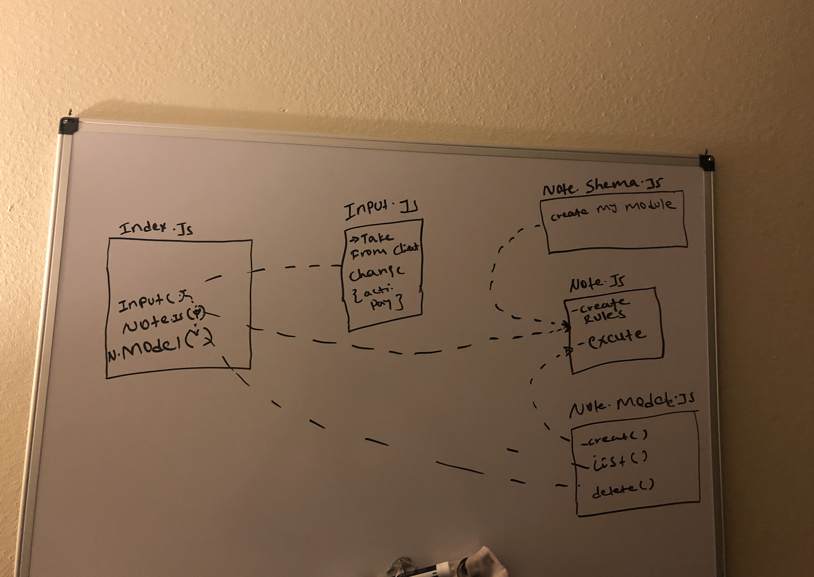

# LAB - Class 04

## Project Name
* Advanced Mongo/Mongoose.

### Author: Henok Gebremedhn

### Links and Resources

- [submission PR](https://github.com/henok-401-javascript/notes/pull/8)

### Setup

#### How to initialize/run your application (where applicable)

* node index.js - a "add note" - c "add category" // to add note and category.
* node index.js -d " specific ID" // how to delete from the database 
* node index.js -l  || -l "category name" // how to list notes name or category. 

#### Tests

- How do you run tests?
* by adding this code you have to see your added note in to your mongodb => node index.js "any note"
- Any tests of note?
* node index.js .... by running this command you have to see your recent note. 
- Describe any tests that you did not complete, skipped, etc
* node index.js delete haven't finish it yet. 

#### UML

